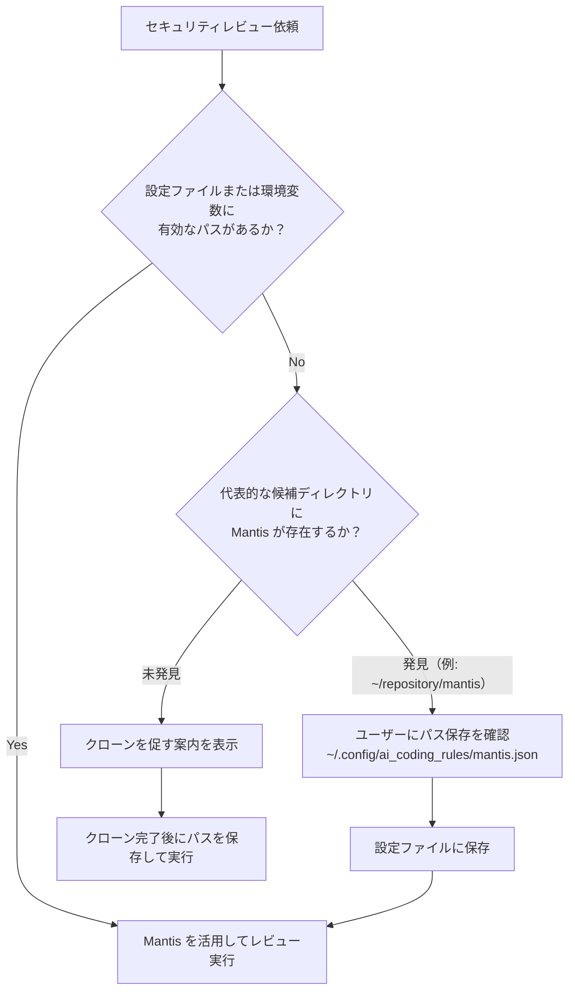

# Mantis セキュリティレビューガイドライン (Mantis Security Review Guidelines)

Google のセキュリティ脆弱性検証ハーネス **Mantis** と連携し、高精度かつ誤検知の少ないセキュリティレビューを実施するための手順とルールを定めます。

---

## 1. Mantis の役割と基本思想

Mantis は単なる脆弱性の推測列挙ツールではなく、AI エージェントに **「仮説立案 (Reviewer) ⇄ 自己反証 (Critic) ⇄ 再現 (Reproduction) ⇄ 最小パッチ作成 (Remediation)」** を自律実行させるハーネスです。

本ガイドラインに従い、レビュー時は単なる可能性の指摘にとどまらず、**「実際に悪用可能か」「フレームワーク既存の防御壁を突破できるか」** を検証した上で、実証可能なシナリオと修正パッチを提示します。

---

## 2. Mantis パスのライフサイクル（特定・記憶・クローン促進）

セキュリティレビュー実行時、AI エージェントは以下の優先順位と手順に従って Mantis の存在確認とパスの管理を行います。

### 探索・特定の優先順位
1. **環境変数**: `$MANTIS_PATH`
2. **グローバル設定ファイル**: `~/.config/ai_coding_rules/mantis.json`（最推奨）
3. **親プロジェクト設定**: 親プロジェクトの `AGENTS.md` または `.mantis_path`

### 状態別のエージェントの振る舞い



#### ① 未クローン状態（Not Cloned）
パスが設定されておらず、以下の代表的な置き場にも見当たらない場合：
- `~/repository/mantis`
- `~/repos/mantis`
- `~/src/mantis`
- `~/projects/mantis`
- 親プロジェクトの同階層（`../mantis`）

**エージェントのアクション**:
- クローンを促すメッセージを表示する。
  ```bash
  # 推奨クローンコマンド例
  git clone https://github.com/google/mantis.git ~/repository/mantis
  ```
- クローン完了後にパスを記憶する旨を伝える。

#### ② クローン済み・未記憶状態（Cloned, Not Memorized）
代表的な候補ディレクトリで Mantis を検知した場合、またはユーザーからパスが提示された場合：

**エージェントのアクション**:
- ユーザーに確認の上、共通設定ディレクトリ `~/.config/ai_coding_rules/mantis.json` を作成・保存する。
  ```json
  {
    "mantis_path": "/home/<user>/repository/mantis"
  }
  ```
- これにより、Gemini、Claude Code、Cursor、Windsurf などのあらゆる AI ツールで共通して利用可能になる。

#### ③ 準備完了状態（Ready）
有効な `mantis_path` が確認できた場合、直ちに Step 3 のレビューフローへ進む。

---

## 3. レビュー実行パイプライン (Reviewer & Critic)

Mantis パスが利用可能な場合、以下の 4 ステップでレビューを実施します。

### Step 1: 脅威モデリングと境界特定 (Threat Modeling)
- 変更差分（git diff）から、外部入力（APIリクエスト、URL、ユーザー入力、環境変数、アップロード等）の境界を特定する。
- 認証・認可のチェックポイントを洗い出す。

### Step 2: 脆弱性の仮説立案 (Reviewer フェーズ)
- Mantis のスキャン・解析スクリプトまたはナレッジを活用し、CWE / OWASP Top 10 に基づく潜在的な脆弱性を検出・列挙する。

### Step 3: 自己反証とフィルタリング (Critic フェーズ)
- 立案した仮説に対し、**「この脆弱性は本当に成立するか？」** を批判的に検証する。
  - フレームワークの自動エスケープや型安全性で防がれていないか？
  - 認証ミドルウェアで既に弾かれていないか？
  - 実際に到達可能なコードパスが存在するか？
- **成立シナリオが示せない推測レベルの指摘は除外**し、ハルシネーションを排除する。

### Step 4: 再現シナリオと最小修正パッチ (Remediation フェーズ)
- フィルタリングを通過した脆弱性について以下を提示する：
  1. **悪用可能な前提条件と再現シナリオ**
  2. **影響度（CWE / 重大度）**
  3. **最小修正パッチ（Unified Diff 形式）**

---

## 4. 指摘の出力形式

`code_review_guideline.md` のフォーマットに準拠しつつ、セキュリティ指摘には「検証結果（成立条件）」と「修正パッチ」を必ず含めます。

```json
{
  "file": "src/api/auth.ts",
  "line": "42-50",
  "category": "security",
  "level": "MUST",
  "description": "SQLインジェクションの脆弱性。Reviewer&Critic検証により、外部入力がサニタイズされずに直接クエリ組み立てに渡るパスが成立することを確認済み。",
  "suggestion": "プリペアドステートメントを使用するように修正してください。\n\n```diff\n- const query = `SELECT * FROM users WHERE id = '${userId}'`;\n+ const query = 'SELECT * FROM users WHERE id = $1';\n```"
}
```
