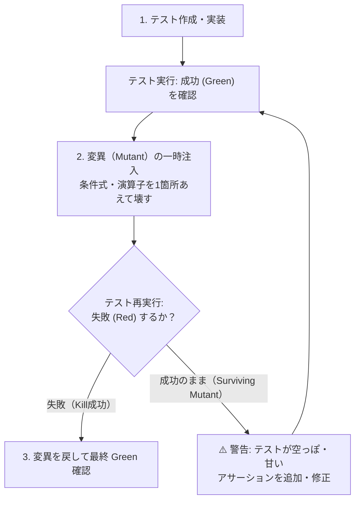

# ミューテーションテスト検証ガイドライン (Mutation Testing Guidelines)

AI が生成するテストコードの「形骸化（見せかけのカバレッジ・アサーション不足・ハルシネーション）」を排除し、真にバグを検知できる堅牢なテストを保証するための原則と検証手順を定めます。

---

## 1. なぜミューテーションテストが必要か？

AI は「テストを書いて」と指示されると、高いコードカバレッジ（行網羅率）を達成するテストを即座に作成できます。しかし、その多くは以下のような致命的な欠陥を抱えています：

- **空アサーション / 緩すぎる検証**: `expect(result).toBeDefined()` や `assert response is not None` のように、値の正当性を検証していない。
- **無意味なモック**: 肝心なビジネスロジックをすべてモックで握りつぶし、テストが常に成功（Green）するように偽装されている。
- **バグを見逃すテスト**: 実装コードのロジックが狂ってもテストが失敗（Red）しない。

これらを撲滅するため、**「コードを意図的に壊し、テストが正しく失敗するか」** を検証する **ミューテーションテスト（変異テスト）** を必須プラクティスとします。

---

## 2. AI 自己変異検証プロセス (Self-Mutation Verification)

外部ツールが導入されていないプロジェクトであっても、AI エージェントが新規テストを作成・修正した際は、以下の **自己変異ステップ（30秒チェック）** を自律的に実行してください。

### 具体的な変異（Mutant）の作り方例
実装コードの核心ロジックに対して、**1箇所だけ一時的に変更**を加えます：
- **境界値の反転**: `if (age >= 18)` → `if (age > 18)` または `if (age < 18)`
- **真偽値の反転**: `isValid = true` → `isValid = false`
- **戻り値の改変**: `return calculateTotal(items)` → `return 0` や `return null`
- **算術演算の変更**: `price - discount` → `price + discount`

### 判定基準
- ⭕ **変異を殺害（Mutant Killed）**: テストが正しく失敗した。  
  → **合格**。変異を元に戻し、コミットへ進む。
- ❌ **変異が生き残った（Mutant Survived）**: 実装を壊したのにテストがパスした。  
  → **不合格**。アサーションが不足しているため、壊した箇所を検知できる `assert` / `expect` を追加する。

---

## 3. プロジェクト規模に応じた自動化ツール

プロジェクトに本格的なミューテーションテストツールを導入する場合、以下のエコシステム標準ツールを推奨します。

| 言語 | 推奨ツール | 実行例 / コマンド |
| :--- | :--- | :--- |
| **TypeScript / JavaScript** | **Stryker** | `npx stryker run` |
| **Python** | **mutmut** | `poetry run mutmut run` / `mutmut results` |
| **Go** | **go-mutesting** | `go-mutesting ./...` |
| **Rust** | **cargo-mutants** | `cargo mutants` |

---

## 4. コードレビュー時の評価基準

コードレビュー担当エージェントは、テストコードをレビューする際に以下の観点を必ずチェックします：

1. **アサーションの厳密性**:
   - オブジェクト全体の形状や、計算結果の厳密値（Equal）が検証されているか？
   - 単なる「例外が発生しないこと」「truthyであること」のチェックで終わっていないか？
2. **境界値（Boundary）の網羅**:
   - `0`, `1`, `上限値`, `上限値+1`, `空配列`, `null/undefined` が個別にアサートされているか？
3. **モックの過剰使用チェック**:
   - テスト対象のドメインロジックそのものがモック化されていないか？（Functional Core は純粋関数としてモックなしでテストする）
