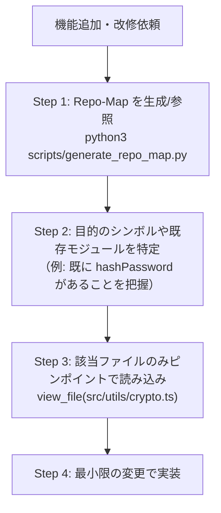

# Repo-Map 活用ガイドライン (Repo-Map Context Minimization Guidelines)

大規模リポジトリの探索時におけるトークン消費を最小化（80〜95% 削減）し、既存コードの見落としや車輪の再発明を防ぐための「Repo-Map（骨格マップ）」の活用手順と原則を定めます。

---

## 1. なぜ Repo-Map が必要か？

AI エージェントがプロジェクト全体を理解しようとして、多数のファイルを丸ごと読み込む（全ファイル走査・大規模 grep）と、以下の問題が発生します：

- **トークン消費の爆発**: 数万〜数十万トークンがあっという間に消費され、コストとレイテンシが増大する。
- **コンテキスト汚染と注意散漫（Lost in the Middle）**: 大量の実装詳細に埋もれ、重要な型定義や関数呼び出し関係を見落とす。
- **ハルシネーション**: 既存のユーティリティや共通モジュールを見落とし、同じ機能を別名で新しく作ってしまう（車輪の再発明）。

これを解決するため、**「まず骨格（型・関数シグネチャ）だけを俯瞰し、必要なファイルのみをピンポイントで読み込む」** 階層的探索（Hierarchical Exploration）を原則とします。

---

## 2. Repo-Map の生成と仕組み

本基盤には、外部ライブラリ不要（Python 3 標準ライブラリのみ）で動作する軽量アナライザが同梱されています。

```bash
# プロジェクトルートで実行（標準出力）
python3 scripts/generate_repo_map.py .

# ファイルに出力して参照する場合
python3 scripts/generate_repo_map.py . > /tmp/repo_map.txt
```

### 出力フォーマット例
実装の中身（関数内部のロジック）を削ぎ落とし、シグネチャと公開インターフェースのみをインデントツリーで表現します：

```
src/auth/service.py
  class AuthService:
    def login(username, password)
    def logout(user_id)
src/auth/types.ts
  export interface User
  export type AuthToken
src/utils/crypto.ts
  export function hashPassword(password)
```

対応言語: **Python (`.py`), TypeScript/JavaScript (`.ts`, `.tsx`, `.js`, `.jsx`), Go (`.go`), Rust (`.rs`)**

---

## 3. AI エージェントの探索手順（階層的アクセス）

プロジェクトの全体構造把握や機能追加を依頼された場合、AI エージェントは以下の手順で調査を進めてください。



1. **Step 1: 骨格の把握**
   - 初めて触るリポジトリや広範な修正を行う際は、まず `python3 scripts/generate_repo_map.py .` を実行し、ファイル構造と関数・クラスの一覧を俯瞰する。
2. **Step 2: 既存コードの再利用チェック**
   - これから作ろうとしている機能・関数に類似したものが既に存在しないか確認する（車輪の再発明を防止）。
3. **Step 3: ピンポイント読み込み**
   - 変更・連携が必要な 1〜3 ファイルのみを特定し、そのファイルの詳細実装（`view_file` 等）を読み込む。
4. **Step 4: 最小差分での実装**
   - 無駄なファイルをコンテキストに読み込まず、クリーンな状態でコーディングを行う。
